## 1. 整体架构

  

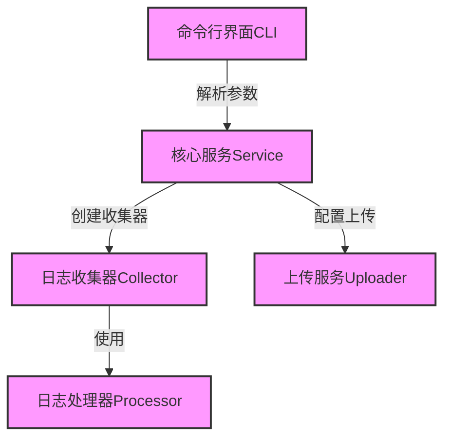

  

## 2. 核心模块说明

  

### 2.1 命令行界面 (CLI)

  

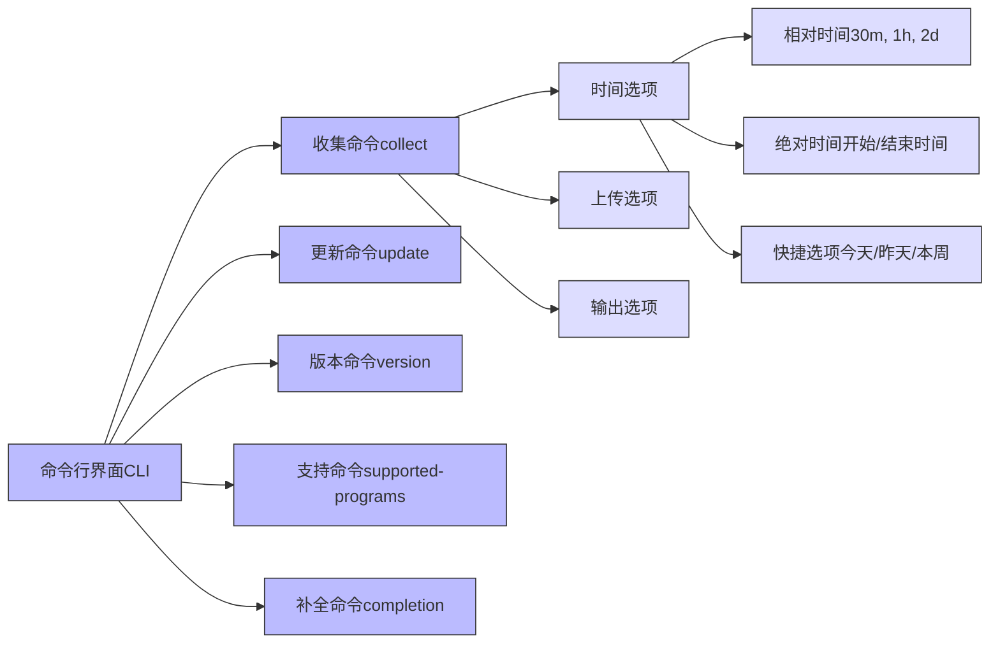

  

### 2.2 核心服务 (Service)

  

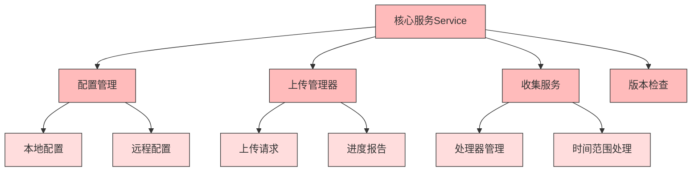

  

### 2.3 日志收集器 (Collector)

  

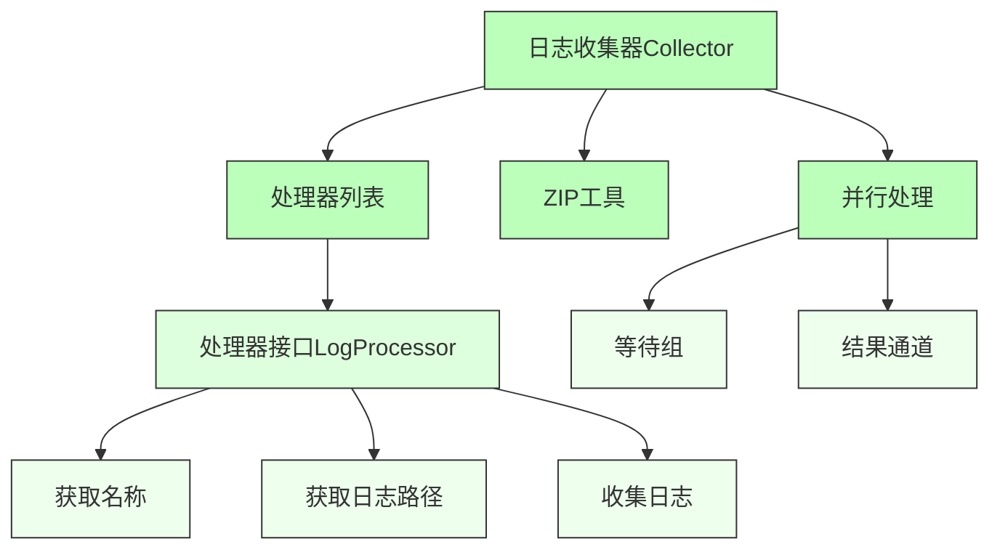

  

### 2.4 日志处理器 (Processor)

  

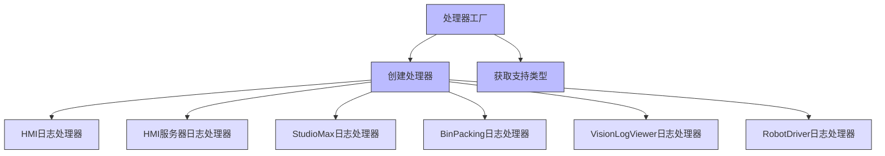

  

### 2.5 上传服务 (Uploader)

  

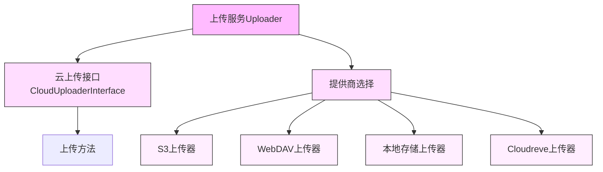

  

## 3. 数据流

  

  

## 4. 主要功能模块

  

### 4.1 时间范围收集

  

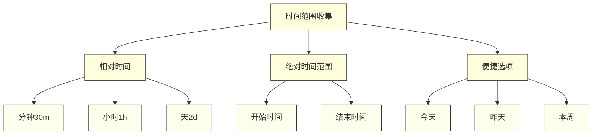

  

### 4.2 智能日志解析

  

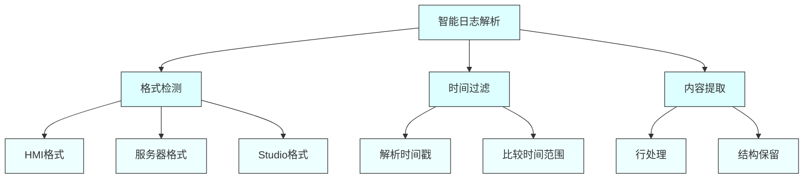

  

### 4.3 日志打包

  

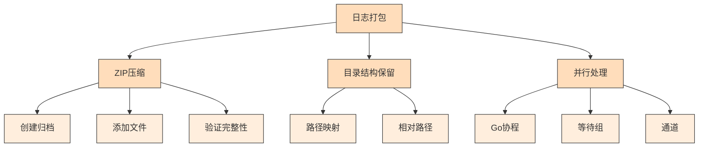

  

### 4.4 快速分享

  

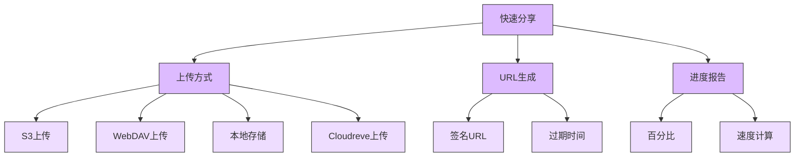

  

## 5. 扩展性设计

  

### 5.1 处理器扩展

  

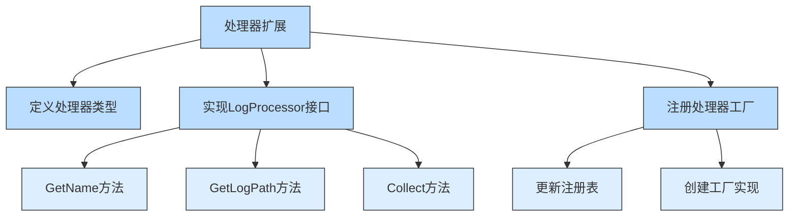

  

### 5.2 上传方式扩展

  

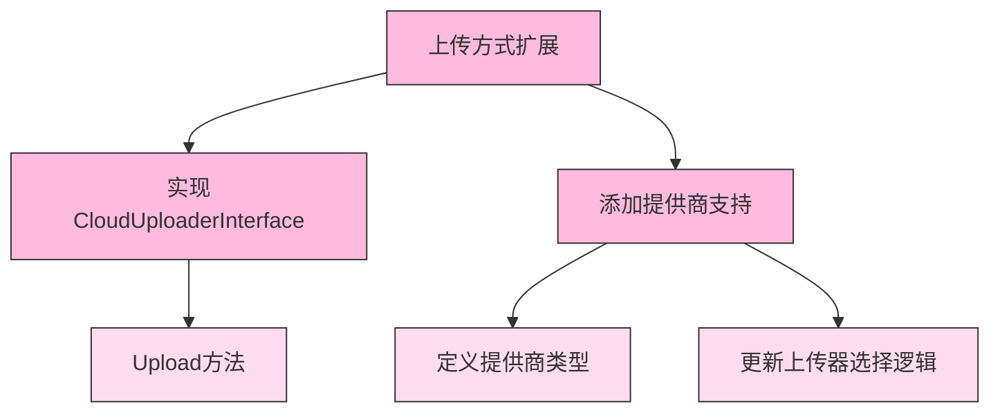

  

## 6. 配置管理

  

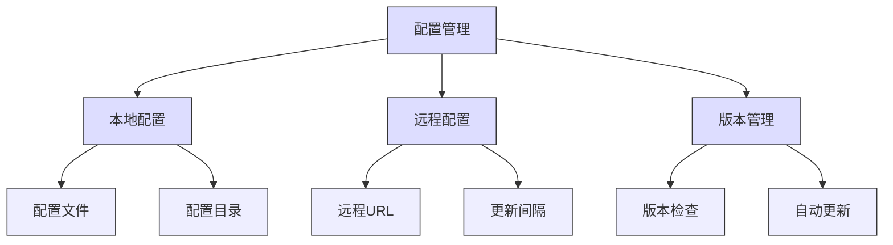